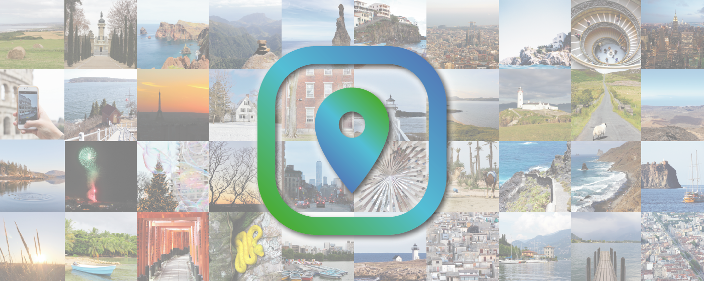
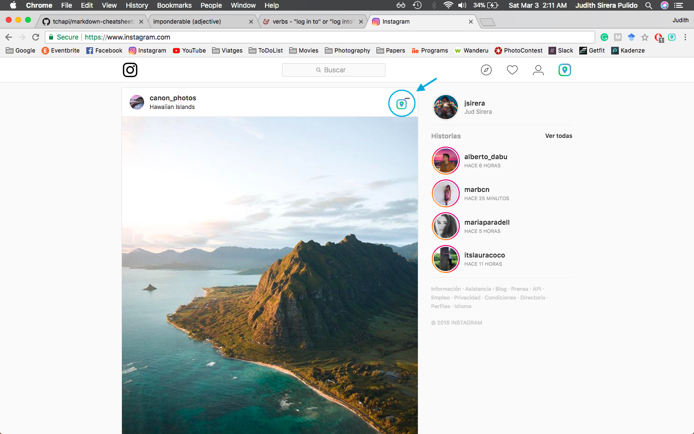
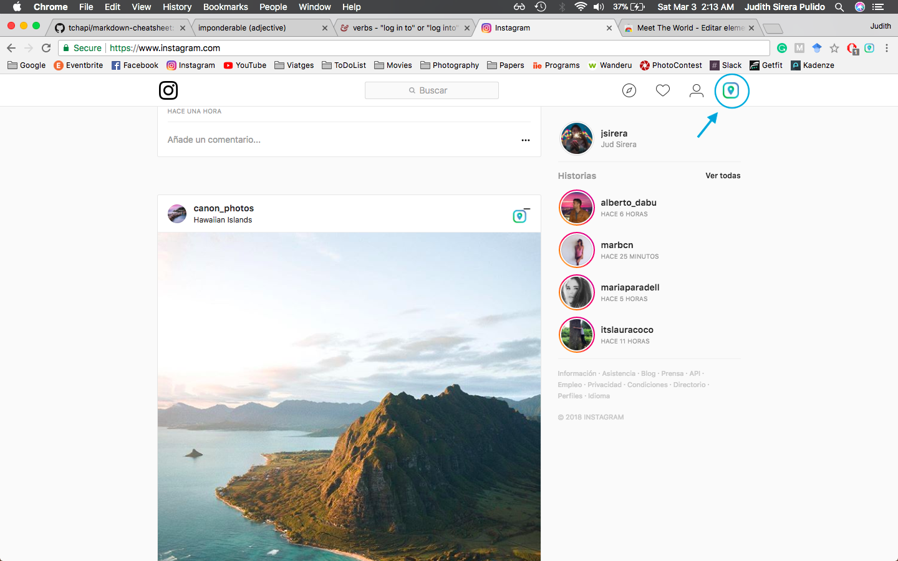
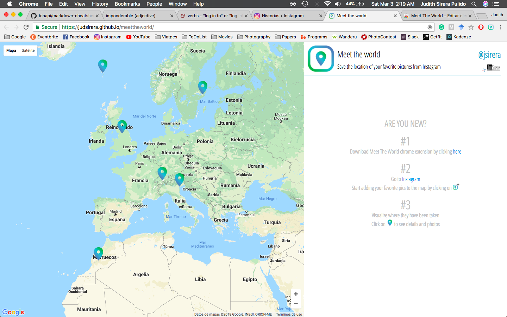
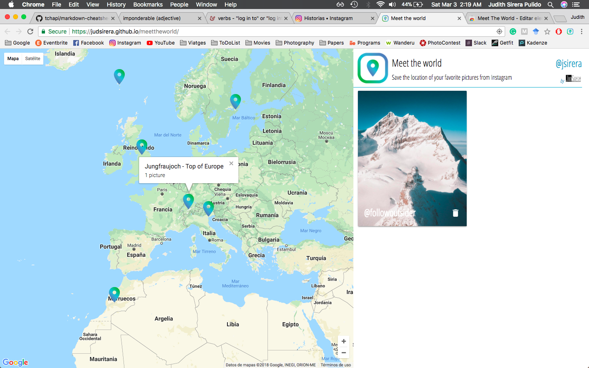

**Meet The World** is an app for saving the location of your favorite Instagram pictures. Then, they are displayed on a map, allowing the user to navigate through them. Save your spots with the google chrome extension [(docs)](https://github.com/judsirera/meettheworld_ChromeExtension) and visualize it them on the website [(docs)](https://github.com/judsirera/meettheworld).

## Requirements
- [x] Instagram account
- [x] Meet The World Chrome extension installed

# Firebase Configuration
Before starting you need to link this app to your firebase app. It has to be the same firebase app than Meet The World Website [docs](https://github.com/judsirera/meettheworld). For that, you just need to write you firebase app configuration parameters where the following code in [firebaseManajer.js](../blob/master/js/firebaseManajer.js):

```javascript
  config: {
    apiKey: YOUR_FIREBASE_APP_APIKEY,
    authDomain: YOUR_FIREBASE_APP_AUTH_DOMAIN,
    databaseURL: YOUR_FIREBASE_APP_DATABASE_URL,
    projectId: YOUR_FIREBASE_APP_PROJECT_ID,
    storageBucket: YOUR_FIREBASE_APP_STORE_BUCKET,
    messagingSenderId: YOUR_FIREBASE_APP_MESSAGING_SENDER_ID
  }
```
These parameters are given by firebase when you [create a project in their console](https://console.firebase.google.com/)

# Instagram Configuration
Since the project is using the Instagram API you need to register your application as a [Instagram Developer](https://www.instagram.com/developer/). This application has to be a different one from Meet The World Website [docs](https://github.com/judsirera/meettheworld), otherwise you won't be allowed to request data. Once your application is registered, get your token with your Client Id and write it in [instagramManajer.js](../blob/master/js/instagramManager.js) where the following lines:

```javascript
  username: "",
  token: YOUR_TOKEN,
  requestApi: 'https://api.instagram.com/v1/locations/',
  requestToken: "",
  type: "GET",
```

# Start

1. Go [here](https://chrome.google.com/webstore/detail/meet-the-world/dnjacdhjmipmijabeoocdgaglpbkbkpp) and install **Meet The World** Chrome extension

2. Log in to [Instagram website](https://www.instagram.com/)

3. Start adding your pictures by clicking the **add** button. Remove that place from your collection by clicking the **delete** button. *Only the posts with location will have the option to be saved*.
    * Add


    * Delete


4. Click on the Meet The World nav bar icon  or go to its website by clicking [here](https://judsirera.github.io/meettheworld/)

5. If you haven't logged in to Instagram, the website will ask you to log in. After that, your locations will be displayed  Click on any of them for seeing the pictures .


*This chrome extension only works for computer browsers*
